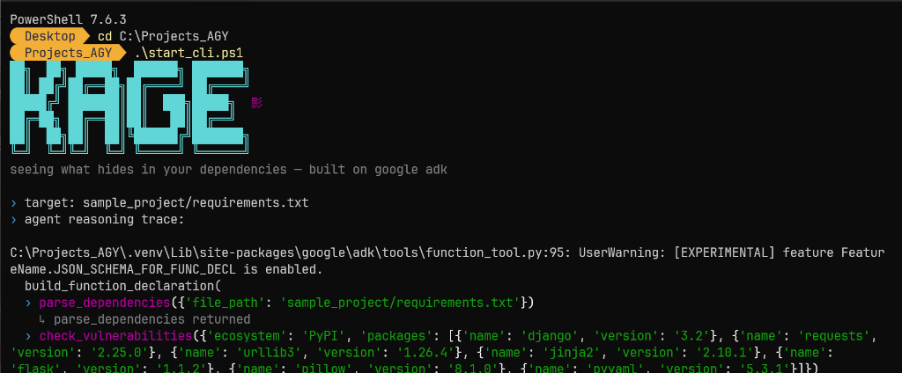

# KAGE
### Autonomous dependency vulnerability triage agent

Built for the Google/Kaggle 5-Day AI Agents Intensive — Vibe Coding Capstone,
on Google's Agent Development Kit (ADK) 2.0.

## Problem

Nobody checks their `requirements.txt` or `package.json` against known CVEs
before shipping. Tools that do this exist (`pip-audit`, `npm audit`) but they
just dump raw CVE IDs — no prioritization, no plain-English risk explanation,
no judgment call on what actually matters.

## What KAGE does

Give it a manifest file. It autonomously:
1. Parses the dependency list
2. Batch-queries [OSV.dev](https://osv.dev) (Google's open vulnerability
   database — free, no auth) for known CVEs/GHSAs per package
3. Pulls full severity/CVSS details for every hit
4. Reasons over the findings and writes a **prioritized** remediation report
   — worst risk first, with concrete upgrade guidance

This is agentic, not a chatbot wrapper: the model decides *when* to call each
tool and *how many times*, based on what it finds. A clean project (no
vulnerable packages) triggers zero detail lookups. A messy one triggers many.

## Architecture

```
kage_agent/
  __init__.py    exposes root_agent (ADK's discovery convention)
  agent.py       LlmAgent definition + system instruction
  tools.py       parse_dependencies / check_vulnerabilities / get_vulnerability_details
main.py          styled CLI entrypoint using ADK's Runner + InMemorySessionService
```

Flow:
```
user runs `python main.py requirements.txt`
        │
        ▼
agent decides: call parse_dependencies
        │
        ▼
agent decides: call check_vulnerabilities(packages)
        │
        ▼
for each vulnerable package →
agent decides: call get_vulnerability_details(vuln_id)
        │
        ▼
agent writes final prioritized report (no more tool calls)
        │
        ▼
Rich renders it in-terminal + saves KAGE_REPORT.md
```

Tools are plain Python functions with Google-style docstrings — ADK reads
those docstrings to build the schema the model sees and auto-wraps them as
`FunctionTool`s the moment they're passed into `LlmAgent(tools=[...])`. No
manual JSON schema, no framework glue code.

## Setup

```bash
python3 -m venv venv
source venv/bin/activate
pip install -r requirements.txt

cp .env.example .env
# edit .env, add your Gemini API key from https://aistudio.google.com/apikey
```

`.env` must contain:
```
GOOGLE_API_KEY=your_key_here
GOOGLE_GENAI_USE_VERTEXAI=FALSE
```
ADK loads this automatically — no manual `export` needed once it's in the
project root.

## Run

**Styled CLI (what to record for the demo video):**
```bash
python main.py sample_project/requirements.txt
```



**ADK's built-in visual inspector** — shows every tool call/response as it
happens in a browser UI, good as a second angle for the video or for your
own debugging:
```bash
adk web
```
Open the printed `localhost` URL, select `kage_agent`, and chat with it
directly (e.g. "scan sample_project/requirements.txt").

The included `sample_project/requirements.txt` is deliberately pinned to
old, vulnerable package versions so there's something real to find on first
run.

## Why this design

- **Plain LlmAgent, no WorkflowAgent/graph.** The task is a straight
  linear tool chain (parse → check → detail → report), not branching or
  parallel — a WorkflowAgent graph would add ceremony without adding
  capability here. Worth knowing ADK 2.0 has that option for more complex
  agents, but using it where it's not needed is over-engineering for a
  five-day build.
- **OSV.dev over paid CVE APIs.** Free, no auth, no rate-limit friction —
  removes a whole category of demo-day failure.
- **Severity-first report ordering**, not chronological or alphabetical —
  the actual value-add over `pip-audit`/`npm audit` is prioritization, so
  the agent is instructed to lead with it.

## Course alignment

| Day | Concept | Where it shows up |
|---|---|---|
| 1 | Vibe coding | Entire repo scaffolded via natural-language prompts, iterated in an agentic CLI |
| 2 | Tools & interoperability | ADK `FunctionTool`s calling a real external API (OSV.dev) |
| 3 | Agent skills | System instruction encodes a reusable triage "skill" — report structure, prioritization logic |
| 4 | Quality & security | The agent's actual domain *is* security triage |
| 5 | Prototype → production | Clean module boundaries, `adk web` for observability, ready for `adk deploy` |
